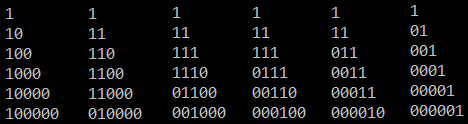

懂了 不组队就不会坑队友了

<!--more-->

### C. Function

我觉得我会

但是我不会

我开始想的算每个数`a[i]`在`n == x`时会被加多少次`c[x][i]`, 然后发现`c[x][i] = c[x - 1][i] + c[x - 1][i - 1] + 1`, 然后就不会求了

首先: 你要知道$f(l, r)$会在答案里出现$\binom{l - 1+ n -r}{l - 1}$次: 可以看作不断把$f(l, r)$变为$f(l - 1, r)$, 或者$f(l, r + 1)$.

然后: 你需要知道对于每个数`a[i]`, 只需要找到所有包含位置$i$的$f(l, r)$出现的次数, 然后加和就可以了

然后你发现对于`a[1]`到`a[n]`, 他需要加起来的那些组合数在帕斯卡三角中的位置是这样的:



然后发现`a[1]`到`a[i + 1]`是加上了一列组合数, 然后删掉了一条斜线上的组合数

然后用两个公式就可以$\mathrm O(n)$递推了
$$
\sum _{i=0} ^{n} \binom {i} {k} = \binom {n+1}{k+1}\\
\sum _{i=0} ^{n} \binom {m+i} {i} = \binom {n+m+1}{n}
$$


```cpp
#include <bits/stdc++.h>
using namespace std;
#define ll long long
#define f(i, x, n) for(int i = x; i < (int)(n); ++i)

int const N = 1000000, md = 1e9 + 7;
int fc[N + 1], inv[N + 1], fcin[N + 1];

void ad(int &x, int y) { if ((x += y) >= md)x -= md; }
void sb(int &x, int y) { if ((x -= y) < 0)x += md; }
int ch(int n, int r) { return (ll)fc[n] * fcin[r] % md * fcin[n - r] % md; }

void solve(){
    int n;
    scanf("%d", &n);
    int s = 0, an = 0;
    f(i, 0, n){
        ad(s, ch(n, i + 1));
        int t;
        scanf("%d", &t);
        ad(an, (ll)t * s % md);
        sb(s, ch(n, i));
    }
    printf("%d\n", an);
}

int main(){
    fc[0] = 1;
    f(i, 1, N + 1)fc[i] = (ll)fc[i - 1] * i % md;
    inv[1] = 1;
    f(i, 2, N + 1)inv[i] = md - md / i * (ll)inv[md % i] % md;
    fcin[0] = 1;
    f(i, 1, N + 1)fcin[i] = (ll)fcin[i - 1] * inv[i] % md;
    int t;
    scanf("%d", &t);
    while (t--)solve();
}

```

### D. Two Sequences

水题

不开O2甚至会T

```cpp
#pragma GCC optimize(2)

#include <iostream>
#include <cstdio>
#include <cstring>
#include <cstdlib>
#include <algorithm>
#include <set>
#define MAXN (100000)
using namespace std;
set<int> a, b;
inline int getint() {
	int re = 0;
	char x = 0;
	while (x < '0' || x > '9') x = getchar();
	while (x <= '9' && x >= '0') re = (re << 1) + (re << 3) + x - '0', x = getchar();
	return re;
}
int main() {
	int t = getint();
	while (t--) {
		a.clear(), b.clear();
		int n, k;
		n = getint(), k = getint();
		for (int i = 1; i <= n; i++) a.insert(getint());
		for (int i = 1; i <= n; i++) b.insert(getint());
		set<int>::iterator x = a.end();
		for (set<int>::iterator i = a.begin(); i != a.end(); ++i) {
			set<int>::iterator bx = b.lower_bound(*i);
			if (bx == b.end() || *bx != *i) x = i;
			else b.erase(bx);
		}
		if (b.size() > 1 || (!b.empty() && abs(*b.begin() - *x) > k)) puts("NO");
		else puts("YES");
	}
	return 0;
}
```

### H. Win Strategy

写了个贪心, 让最后一道题结束的时间尽量靠前

```cpp
// 贪心 在当前时间i下, 把剩下的题分为两组, 一组是a在i前(按b排), 一组是a在i后(按(a + b)排), 比较两组的队首, 然后取一个数 

// #pragma GCC optimize(2)

#include <iostream>
#include <cstdio>
#include <cstring>
#include <cstdlib>
#include <algorithm>
#include <queue>
#include <set>
#define MAXN (1000)
using namespace std;
struct tas {
	int a, b, bh;
	bool operator == (const tas& x) {
		return (x.a == a && x.b == b);
	}
} ab[MAXN + 5];
struct cmp1 {
	bool operator () (tas x, tas y) { return x.b < y.b; }
};
struct cmp2 {
	bool operator () (tas x, tas y) { return x.a + x.b < y.a + y.b; }
};
int n, l;
bool vis[MAXN + 5];
int main() {
	int t;
	scanf("%d", &t);
	while (t--) {
		memset(vis, false, sizeof(vis));
		scanf("%d%d", &n, &l);
		for (int i = 1; i <= n; i++) scanf("%d%d", &ab[i].a, &ab[i].b), ab[i].bh = i;
		int ans = 0, j = 1;
		multiset<tas, cmp1> alr;
		multiset<tas, cmp2> fut;
		for (int i = 1; i <= n; i++) fut.insert(ab[i]);
		for (int i = 1; i <= l;) {
			for (; j <= n && ab[j].a <= i; j++)
				if (!vis[j]) {
					multiset<tas>::iterator x = fut.lower_bound(ab[j]);
					if (x != fut.end())
						fut.erase(x), alr.insert(ab[j]);
				}
			if (!alr.empty() && (fut.empty() || (alr.begin()->b + i < fut.begin()->a + fut.begin()->b))) {
				if (alr.begin()->b + i <= l) {
					i = alr.begin()->b + i;
					vis[alr.begin()->bh] = true;
					alr.erase(alr.begin());
					++ans;
				}
				else break;
			}
			else {
				if (!fut.empty() && (fut.begin()->a + fut.begin()->b <= l)) {
					i = fut.begin()->b + fut.begin()->a;
					vis[fut.begin()->bh] = true;
					fut.erase(fut.begin());
					++ans;
				}
				else break;
			}
		}
		printf("%d\n", ans);
	}
	return 0;
}
```

蛋是WA了

看题解直接背包 $\mathrm O(2.5 \times 10^8)$, 不愧是你

```cpp
#include <bits/stdc++.h>
using namespace std;

typedef pair<int,int> pii;
const int N = 1001;
int n , l , dp[N][N],T;

pii a[N];

int calc(int idx , int time){
    if(idx > n || time > l+1)return -N;
    if(idx == n && time == l+1)return 0;
    int &ret = dp[idx][time];
    if(ret != -1)return ret;
    ret = max(calc(idx,time+1),calc(idx+1,time));
    if(time >= a[idx].first)
        ret = max(ret,1+calc(idx+1,time+a[idx].second));
    return ret;
}
int main(){
    cin >> T;
    while(T--){
        memset(dp,-1,sizeof dp);
        cin >> n >> l;
        for (int i = 0; i < n; ++i)scanf("%d%d",&a[i].first,&a[i].second);
        printf("%d\n",calc(0,1));
    }

    return 0;
}
```


By Cansult